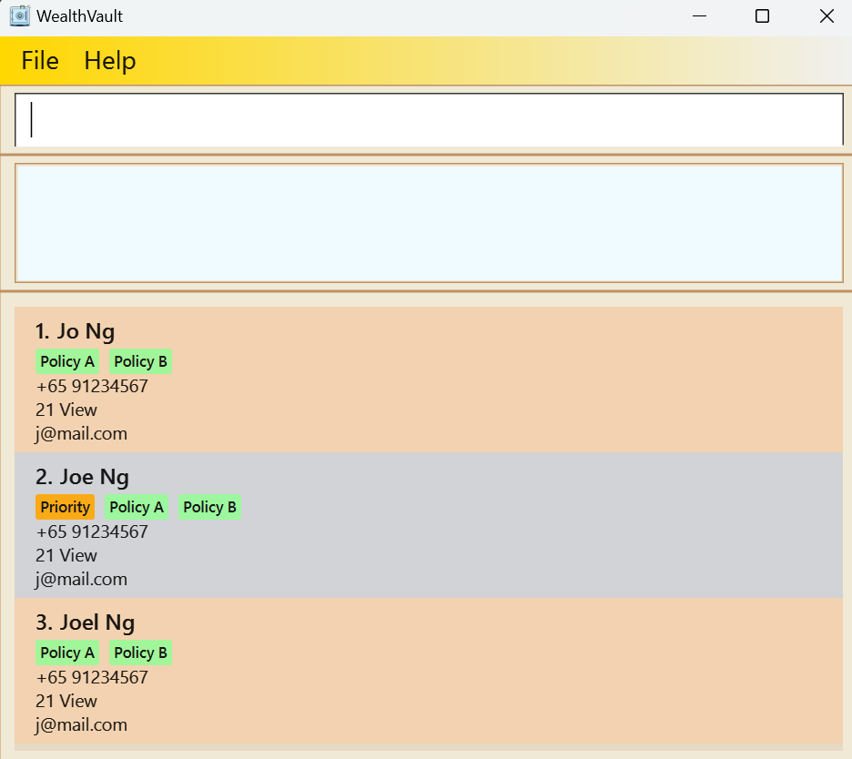

# WealthVault User Guide

WealthVault is a **desktop app for managing contacts, optimized for use via a  Line Interface** (CLI) while still having the benefits of a Graphical User Interface (GUI). If you can type fast, WealthVault can get your contact management tasks done faster than traditional GUI apps.

<!-- * Table of Contents -->
<page-nav-print />

--------------------------------------------------------------------------------------------------------------------

## Quick start

1. Ensure you have Java `17` or above installed in your Computer. 
   **Mac users:** Ensure you have the precise JDK version prescribed [here](https://se-education.org/guides/tutorials/javaInstallationMac.html).

1. Download the latest `.jar` file from [here](https://github.com/AY2425S2-CS2103T-W12-2/tp/releases/tag/v1.3).

1. Copy the file to the folder you want to use as the _home folder_ for your application.

1. Open a command terminal, `cd` into the folder you put the jar file in, and use the `java -jar wealthvault.jar` command to run the application. 
   A GUI similar to the below should appear in a few seconds. Note how the app contains some sample data. 
   

1. Type the command in the command box and press Enter to execute it. e.g. typing **`help`** and pressing Enter will open the help window. 
   Some example commands you can try:

   * `list` : Lists all contacts.

   * `addc n/John Doe p/98765432 e/johnd@example.com a/John street, block 123, #01-01` : Adds a contact named `John Doe` to the application.

   * `delc 3` : Deletes the 3rd contact shown in the current list.

   * `clear` : Deletes all contacts.

   * `exit` : Exits the app.

1. Refer to the [Features](#features) below for details of each command.

--------------------------------------------------------------------------------------------------------------------

## Features

<box type="info" seamless>

**Notes about the command format:** 

* Words in `UPPER_CASE` are the parameters to be supplied by the user. 
  e.g. in `addc n/NAME`, `NAME` is a parameter which can be used as `addc n/John Doe`.

* Items in square brackets are optional. 
  e.g `n/NAME [t/POLICY_TAG]` can be used as `n/John Doe t/Policy A` or as `n/John Doe`.

* Items with `…`​ after them can be used multiple times including zero times. 
  e.g. `[t/POLICY_TAG]…​` can be used as ` ` (i.e. 0 times), `t/Policy A`, `t/Policy B t/Policy C` etc.

* Parameters can be in any order. 
  e.g. if the command specifies `n/NAME p/PHONE_NUMBER`, `p/PHONE_NUMBER n/NAME` is also acceptable.

* Extraneous parameters for commands that do not take in parameters (such as `help`, `list`, `exit` and `clear`) will be ignored. 
  e.g. if the command specifies `help 123`, it will be interpreted as `help`.

* If you are using a PDF version of this document, be careful when copying and pasting commands that span multiple lines as space characters surrounding line-breaks may be omitted when copied over to the application.
</box>

### Viewing help : `help`

Shows a message explaning how to access the help page.

**Format:** `help`

### Adding a client: `addc`

Adds a client to WealthVault.

**Format:** `addc n/NAME p/PHONE_NUMBER e/EMAIL a/ADDRESS [t/POLICY_TAG]…​`

<box type="tip" seamless>

**Tips:** 
- Policy tags are not compulsory when adding a client, but if the t/ prefix is used, it must
be accompanied by a valid policy name.

</box>

**Examples:**
* `addc n/John Doe p/98765432 e/johnd@example.com a/John street, block 123, #01-01`
* `addc n/Betsy Crowe t/Policy A e/betsycrowe@example.com a/Newgate Prison p/1234567 t/Prison End-of-Life Insurance`

### Adding a policy: `addp`

Adds a policy to a client in WealthVault.

**Format:** `addp INDEX t/POLICY_TAG`

<box type="tip" seamless>

**Tips:** 
- If the t/ prefix is used, it must be accompanied by a valid policy name.
</box>

**Examples:**
* `addp 1 t/Health Insurance`
* `addp 2 t/Home Protection Plan`

### Listing all clients : `list`

Shows a list of all clients in WealthVault.

**Format:** `list`

### Editing a client : `edit`

Edits an existing client in WealthVault.

**Format:** `edit INDEX [n/NAME] [p/PHONE] [e/EMAIL] [a/ADDRESS] [t/POLICY_TAG]…​`

* Edits the client at the specified `INDEX`. The index refers to the index number shown in the displayed client list. The index **must be a positive integer** 1, 2, 3, …​
* At least one of the optional fields must be provided.
* Existing values will be updated to the input values.
* When editing tags, the existing tags of the client will be removed i.e adding of tags is not cumulative.
* You can remove all the client’s tags by typing `t/` without
    specifying any tags after it.

**Examples:**
*  `edit 1 p/91234567 e/johndoe@example.com` Edits the phone number and email address of the 1st client to be `91234567` and `johndoe@example.com` respectively.
*  `edit 2 n/Betsy Crower t/` Edits the name of the 2nd client to be `Betsy Crower` and clears all existing tags.

### Locating clients by name: `findclient`

Finds clients whose names contain any of the given keywords.

**Format:** `findclient KEYWORD [MORE_KEYWORDS]`

* The search is case-insensitive. e.g `hans` will match `Hans`
* The order of the keywords does not matter. e.g. `Hans Bo` will match `Bo Hans`
* Only the name is searched.
* Only full words will be matched e.g. `Han` will not match `Hans`
* Clients matching at least one keyword will be returned (i.e. `OR` search).
  e.g. `Hans Bo` will return `Hans Gruber`, `Bo Yang`

**Examples:**
* `findclient John` returns `john` and `John Doe`
* `findclient alex david` returns `Alex Yeoh`, `David Li` 
  

### Locating clients by name and tag: `findclientor`

Finds clients whose name or tag contain any of the given keywords.

**Format:** `findclientor KEYWORD [MORE_KEYWORDS]`

* The search is case-insensitive. e.g `hans` will match `Hans`
* The order of the keywords does not matter. e.g. `Hans Bo` will match `Bo Hans`
* Both the name and the tag is searched.
* Only full words will be matched e.g. `Han` will not match `Hans`
* Clients matching at least one keyword will be returned (i.e. `OR` search).
  e.g. `Hans Bo` will return `Hans Gruber`, `Bo Yang`

**Examples:**
* `findclientor John` returns `john` and `John Doe`
* `findclientor alex david priority` returns `Alex Yeoh`, `David Li` and anyone with the `Priority` tag attached 
  

### Locating specific clients by name and tag: `findclientand`

Finds clients whose name or tag contain all of the given keywords.

**Format:** `findclientand KEYWORD [MORE_KEYWORDS]`

* The search is case-insensitive. e.g `hans` will match `Hans`
* The order of the keywords does not matter. e.g. `Hans Bo` will match `Bo Hans`
* Both the name and the tag is searched.
* Only full words will be matched e.g. `Han` will not match `Hans`
* Clients matching at least one keyword will be returned (i.e. `OR` search).
  e.g. `Hans Bo` will return `Hans Gruber`, `Bo Yang`

**Examples:**
* `findclientand John` returns `john` and `John Doe`
* `findclientand friends priority` returns only people with the `Priority` and `friends` tags attached 
  

### Deleting a client : `delc`

Deletes the specified client from WealthVault.

**Format:** `delc INDEX`

* Deletes the client at the specified `INDEX`.
* The index refers to the index number shown in the displayed client list.
* The index **must be a positive integer** 1, 2, 3, …​

**Examples:**
* `list` followed by `delc 2` deletes the 2nd client in WealthVault.
* `findclient Betsy` followed by `delc 1` deletes the 1st client in the results of the `findclient` command.

### Deleting a policy: `delp`

Deletes the specified policy from WealthVault.

**Format:** `delp INDEX`

* Deletes the policy at the specified `INDEX`.
* The index refers to the index number shown in the displayed policy list.
* The index **must be a positive integer** 1, 2, 3, …​

**Examples:**
* `listpolicy` followed by `delp 2` deletes the 2nd policy in WealthVault.
* `findpolicy Home` followed by `delp 1` deletes the 1st policy in the results of the `findpolicy` command.

### Prioritising a client: `priority`

Toggles the priority of the specified client from WealthVault as indicated with a "Priority" tag.

**Format:** `priority INDEX`

* Adds a "Priority" tag to the specified `INDEX` if such a tag isn't attached to the client
* Removes the "Priority" tag of the specified `INDEX` if such a tag is already attached to the client
* The index **must be a positive integer** 1, 2, 3, …​

**Examples:**
* `list` followed by `priority 1` adds a priority tag to the 1st client in the list if the client is yet to be attached with a "Priority" tag.
* `list` followed by `priority 3` removes a priority tag from the 3rd client in the list if the client is attached with a "Priority" tag.

### Clearing all entries : `clear`

Clears all entries from WealthVault.

**Format:** `clear`

### Exiting the program : `exit`

Exits the program.

**Format:** `exit`

### Saving the data

WealthVault data are saved in the hard disk automatically after any command that changes the data. There is no need to save manually.

### Editing the data file

WealthVault data are saved automatically as a JSON file `[JAR file location]/data/addressbook.json`. Advanced users are welcome to update data directly by editing that data file.

<box type="warning" seamless>

**Caution:**
If your changes to the data file makes its format invalid, WealthVault will discard all data and start with an empty data file at the next run.  Hence, it is recommended to take a backup of the file before editing it. 
Furthermore, certain edits can cause WealthVault to behave in unexpected ways (e.g., if a value entered is outside the acceptable range). Therefore, edit the data file only if you are confident that you can update it correctly.
</box>

### Archiving data files `[coming in v2.0]`

_Details coming soon ..._

--------------------------------------------------------------------------------------------------------------------

## FAQ

**Q**: How do I transfer my data to another Computer? 
**A**: Install the app in the other computer and overwrite the empty data file it creates with the file that contains the data of your previous WealthVault home folder.

--------------------------------------------------------------------------------------------------------------------

## Known issues

1. **When using multiple screens**, if you move the application to a secondary screen, and later switch to using only the primary screen, the GUI will open off-screen. The remedy is to delete the `preferences.json` file created by the application before running the application again.
2. **If you minimize the Help Window** and then run the `help` command (or use the `Help` menu, or the keyboard shortcut `F1`) again, the original Help Window will remain minimized, and no new Help Window will appear. The remedy is to manually restore the minimized Help Window.

--------------------------------------------------------------------------------------------------------------------

## Command summary

| Action            | Format, Examples                                                                                                                                                                |
|------------------|---------------------------------------------------------------------------------------------------------------------------------------------------------------------------------|
| **Add Client**     | `addc n/NAME p/PHONE_NUMBER e/EMAIL a/ADDRESS [t/POLICY_TAG]…​`   e.g., `addc n/James Ho p/22224444 e/jamesho@example.com a/123, Clementi Rd, 1234665 t/Policy A t/Policy B` |
| **Add Policy**     | `addp INDEX t/POLICY_TAG `   e.g., `addp 1 t/Health Insurance`                                                                                                               |
| **Clear**         | `clear`                                                                                                                                                                         |
| **Delete Client**  | `delc INDEX`  e.g., `delc 3`                                                                                                                                                 |
| **Delete Policy**  | `delp INDEX t/POLICY_TAG`  e.g., `delp 2 t/Health Insurance`                                                                                                                 |
| **Edit**          | `edit INDEX [n/NAME] [p/PHONE_NUMBER] [e/EMAIL] [a/ADDRESS] [t/POLICY_TAG]…​`  e.g.,`edit 2 n/James Lee e/jameslee@example.com`                                              |
| **Find**          | `findclient KEYWORD [MORE_KEYWORDS]`  e.g., `findclient James Jake`                                                                                                          |
| **Find (Or)**     | `findclientor KEYWORD [MORE_KEYWORDS]`  e.g., `findclientor James Jake`                                                                                                      |
| **Find (And)**    | `findclientand KEYWORD [MORE_KEYWORDS]`  e.g., `findclientand James Jake`                                                                                                    |
| **Priority**      | `priority INDEX`  e.g.,`priority 1`                                                                                                                                          |
| **List**          | `list`                                                                                                                                                                          |
| **Help**          | `help`                                                                                                                                                                          |

